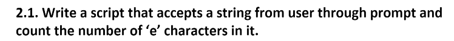

### Count e characters

A task for ITI on day 1 of the JS course to count all the e characters of a string as shown in the [demonstration](https://youtu.be/TfBtiWpWoKI).

## Requirements

Try the [count e characters](https://aya-hegab.github.io/count_e_chars-js-day1_task1-iti/) now.
